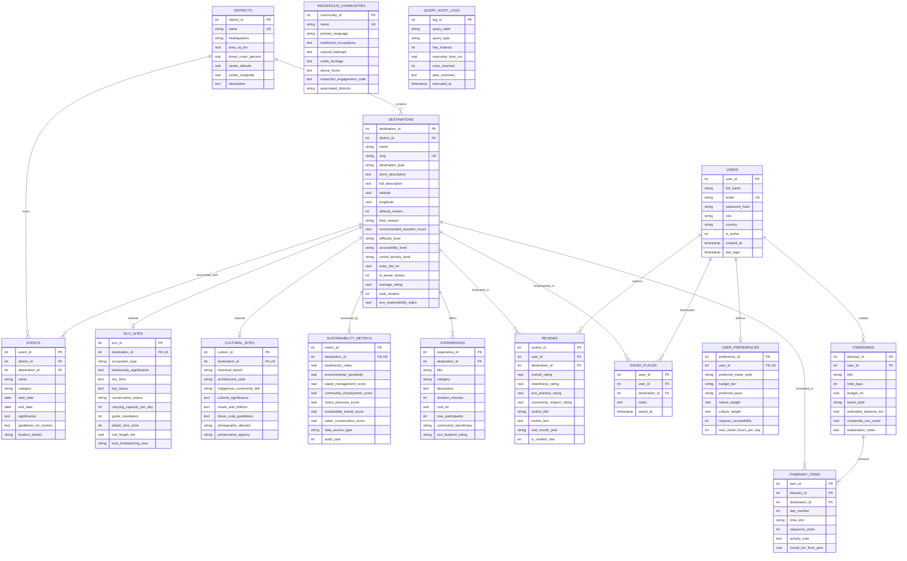

# Entity-Relationship (ER) Diagram — Tripura Terra

## Overview
This document specifies the conceptual and logical data model for the **Tripura Terra** intelligent tourism platform. The database architecture is designed in Third Normal Form (3NF) to support transactional integrity, multi-dimensional sustainability indicators, explainable recommendations, and GIS location attributes.

---

## Complete Mermaid ER Diagram

---

## Cardinality and Referential Integrity Rules

| Relationship | Cardinality | Enforcement | Cascade Action |
|:---|:---:|:---|:---|
| `districts` $\rightarrow$ `destinations` | $1 : N$ | Foreign Key (`district_id`) | `ON DELETE RESTRICT` |
| `destinations` $\rightarrow$ `eco_sites` | $1 : 0..1$ | Foreign Key (`destination_id`) Unique | `ON DELETE CASCADE` |
| `destinations` $\rightarrow$ `cultural_sites` | $1 : 0..1$ | Foreign Key (`destination_id`) Unique | `ON DELETE CASCADE` |
| `destinations` $\rightarrow$ `sustainability_metrics` | $1 : 1$ | Foreign Key (`destination_id`) Unique | `ON DELETE CASCADE` |
| `destinations` $\rightarrow$ `experiences` | $1 : N$ | Foreign Key (`destination_id`) | `ON DELETE CASCADE` |
| `users` $\rightarrow$ `user_preferences` | $1 : 1$ | Foreign Key (`user_id`) Unique | `ON DELETE CASCADE` |
| `users` $\times$ `destinations` $\rightarrow$ `reviews` | $M : N$ | Composite Unique (`user_id`, `destination_id`) | `ON DELETE CASCADE` |
| `users` $\times$ `destinations` $\rightarrow$ `saved_places`| $M : N$ | Composite Unique (`user_id`, `destination_id`) | `ON DELETE CASCADE` |
| `users` $\rightarrow$ `itineraries` | $1 : N$ | Foreign Key (`user_id`) | `ON DELETE CASCADE` |
| `itineraries` $\rightarrow$ `itinerary_items` | $1 : N$ | Foreign Key (`itinerary_id`) | `ON DELETE CASCADE` |
| `destinations` $\rightarrow$ `itinerary_items` | $1 : N$ | Foreign Key (`destination_id`) | `ON DELETE CASCADE` |
| `districts` $\rightarrow$ `events` | $1 : N$ | Foreign Key (`district_id`) | `ON DELETE RESTRICT` |
