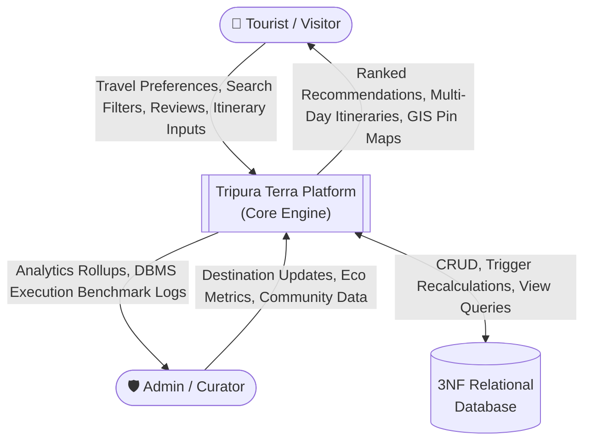
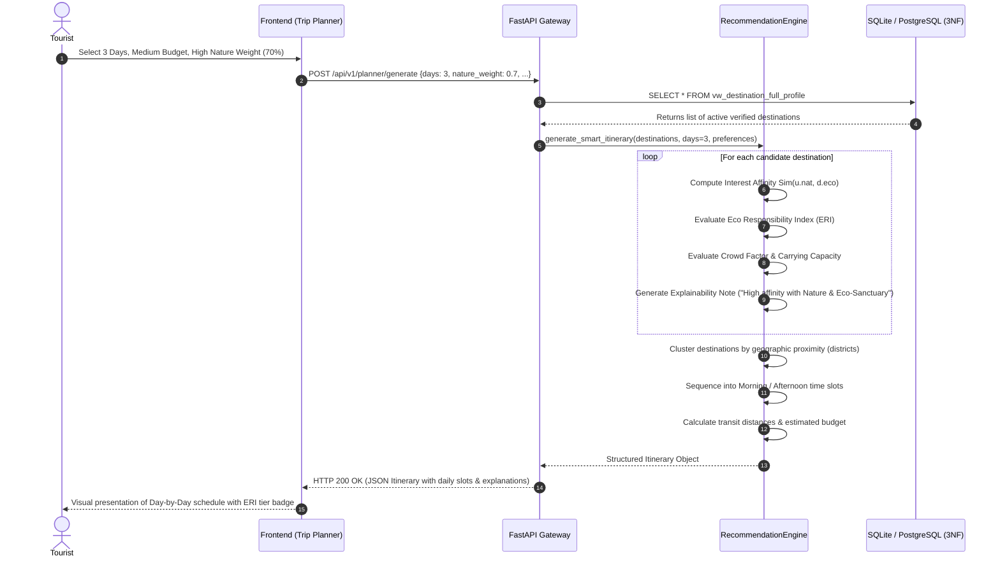
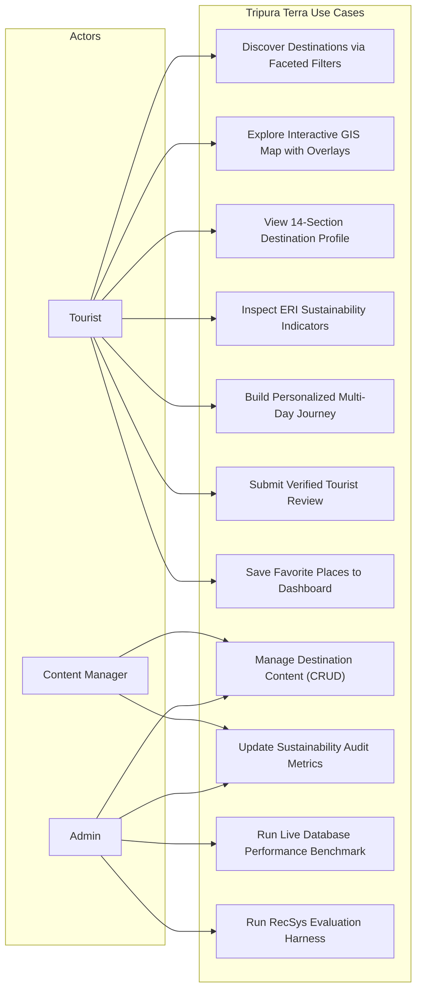

# System Architecture & Data Flow Diagrams (DFD) — Tripura Terra

## 1. System Architecture Overview

Tripura Terra is built on a clean, decoupled 4-tier architecture designed for low latency, reproducible scientific experimentation, and strict data governance:

```mermaid
graph TD
    subgraph Tier1["1. Presentation Tier (Frontend UI)"]
        UI_Home["Editorial Discovery View"]
        UI_Faceted["Faceted Search & Discovery"]
        UI_Profile["14-Section Destination Profile"]
        UI_GIS["Interactive Leaflet GIS Map"]
        UI_Planner["Smart Trip Planner Wizard"]
        UI_Analytics["Analytics & Research Charts"]
    end

    subgraph Tier2["2. Application & API Gateway (FastAPI)"]
        API_Router["FastAPI REST Endpoints (/api/v1/...)"]
        Auth_MW["RBAC & JWT Security Middleware"]
        CORS_MW["CORS & Request Handlers"]
    end

    subgraph Tier3["3. Intelligent Business Logic & Algorithmic Tier"]
        Rec_Engine["Explainable Recommendation Engine"]
        Sust_Engine["Eco Responsibility Index (ERI) Calculator"]
        Planner_Engine["Multi-Day Itinerary Synthesizer"]
        Benchmark_Harness["DBMS Indexing & RecSys Evaluation Harness"]
    end

    subgraph Tier4["4. Relational Database Management Tier (DBMS)"]
        DB_Core[("SQLite 3.x / PostgreSQL 3NF Engine")]
        Triggers["Recalculation Triggers (Ratings, ERI)"]
        Views["Analytical Views (vw_full_profile, vw_district_analytics)"]
        Indexes["Composite B-Tree & Spatial Indexes"]
    end

    Tier1 -->|JSON REST Requests| Tier2
    Tier2 -->|Invoke Services| Tier3
    Tier3 -->|SQL / Transaction Operations| Tier4
    Tier4 -->|Result Sets / Query Plans| Tier3
    Tier3 -->|Structured Payloads| Tier2
    Tier2 -->|HTTP Response (JSON)| Tier1
```

---

## 2. Level 0 Data Flow Diagram (Context Level)



---

## 3. Level 1 Data Flow Diagram (Functional Decomposition)

```mermaid
flowchart TD
    Tourist(["👤 Tourist"])
    
    P1["1.0 User Authentication & RBAC"]
    P2["2.0 Faceted Discovery & GIS Navigation"]
    P3["3.0 Explainable Recommender Engine"]
    P4["4.0 Smart Trip Planner & Synthesis"]
    P5["5.0 Sustainability (ERI) Assessment"]
    P6["6.0 Review Management & Integrity"]
    P7["7.0 Analytics & Performance Benchmarking"]

    D_Users[("USERS & PREFERENCES")]
    D_Dest[("DESTINATIONS & EXTENSIONS")]
    D_Metrics[("SUSTAINABILITY_METRICS")]
    D_Reviews[("REVIEWS")]
    D_Itin[("ITINERARIES & ITEMS")]
    D_Logs[("QUERY_AUDIT_LOGS")]

    Tourist -->|Credentials| P1
    P1 <-->|Verify / Issue JWT| D_Users

    Tourist -->|Faceted Filters (District, Crowd, Eco)| P2
    P2 <-->|Fetch Profile / Map Pins| D_Dest

    Tourist -->|Affinity Weights (Nature, Culture, Budget)| P3
    P3 <-->|Evaluate Multi-Attribute Score| D_Dest
    P3 <-->|Check Indicator Integrity| D_Metrics
    P3 -->|Scored Recommendations + Explanations| Tourist

    Tourist -->|Days, Pace, Budget, Style| P4
    P4 <-->|Synthesize Geographic Route| D_Dest
    P4 -->|Store Created Trip| D_Itin

    Tourist -->|Submit Star Rating & Review| P6
    P6 -->|Insert Review| D_Reviews
    D_Reviews -.->|Trigger Update| D_Dest

    Admin(["🛡️ Admin"]) -->|Run Query Latency Tests| P7
    P7 <-->|EXPLAIN QUERY PLAN| D_Dest
    P7 -->|Write Performance Record| D_Logs
```

---

## 4. Sequence Diagram: Smart Itinerary Generation & Explainability



---

## 5. Use Case Diagram


